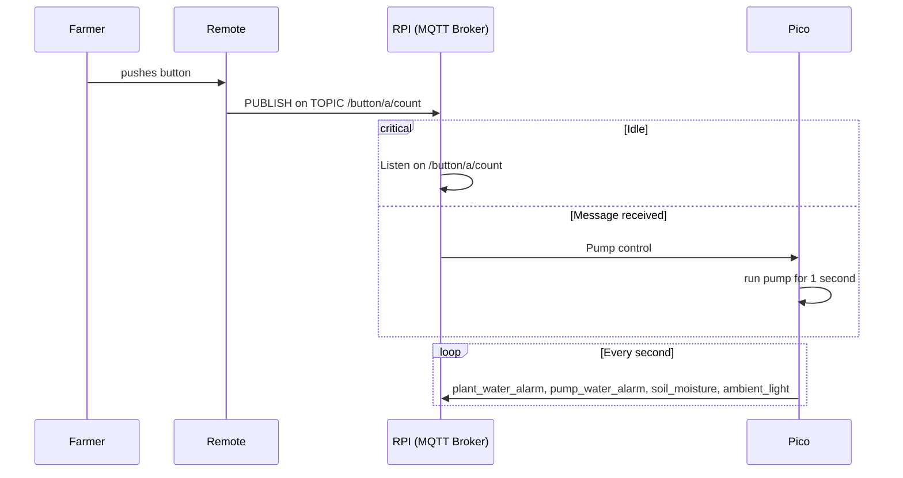

```mermaid
sequenceDiagram
    participant Farmer
    participant Remote
    participant RPI as RPI (MQTT Broker)
    participant Pico
    Farmer->>Remote: pushes button
    Remote->>RPI: PUBLISH on TOPIC /button/a/count
    critical Idle
        RPI->>RPI: Listen on /button/a/count
    option Message received
        RPI->>Pico: Pump control
    Pico->>Pico: run pump for 1 second
    end
    loop Every second
        Pico->>RPI: plant_water_alarm, pump_water_alarm, soil_moisture, ambient_light
    end
```
